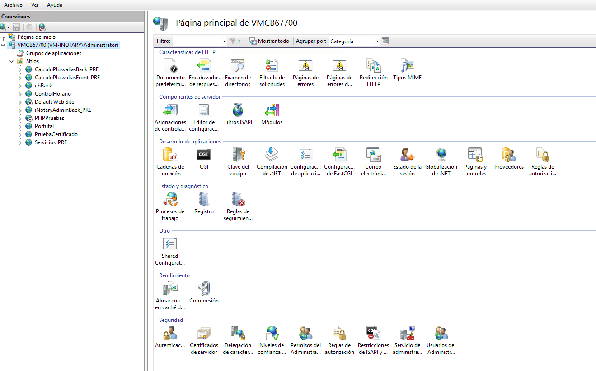
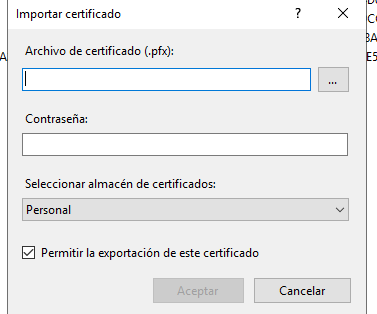
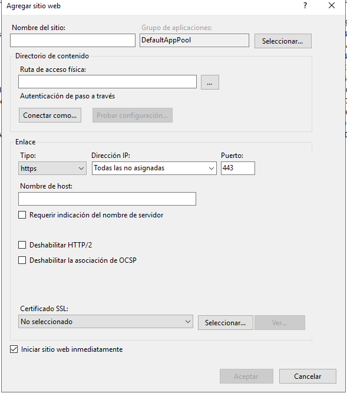
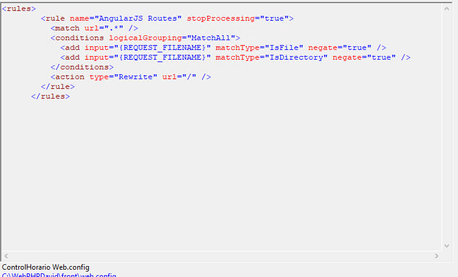

# ControlHorario

This project was generated with [Angular CLI](https://github.com/angular/angular-cli) version 17.1.2.

## Instalar Developent Server

Descargar del git

Por SSH
git@github.com:dsansnuoc/controlHorario_front.git

Por HTTPS
https://github.com/dsansnuoc/controlHorario_front.git

Ir a la carpeta y ejecutar `npm install`

## Development server

Run `ng serve` for a dev server. Navigate to `http://localhost:4200/`. The application will automatically reload if you change any of the source files.

O run `ng serve -o` for a dev server and navigate direct to `http://localhost:4200/`

## Code scaffolding

Run `ng generate component component-name` to generate a new component. You can also use `ng generate directive|pipe|service|class|guard|interface|enum|module`.

## Build

Run `ng build` to build the project. The build artifacts will be stored in the `dist/` directory.

## Running unit tests

Run `ng test` to execute the unit tests via [Karma](https://karma-runner.github.io).

## Running end-to-end tests

Run `ng e2e` to execute the end-to-end tests via a platform of your choice. To use this command, you need to first add a package that implements end-to-end testing capabilities.

## Further help

To get more help on the Angular CLI use `ng help` or go check out the [Angular CLI Overview and Command Reference](https://angular.io/cli) page.

# Para poder trabajar con Angular, lo primero que debemos de tener instalado es NodeJs

## NodeJs

Verificamos la versión instalada con `node -v`
La versión utilizada es la v20.11.0
En caso de la versión instalada es inferior a la esta, iremos a [NodeJS](https://nodejs.org/en/download) a instalar la versión actual.

## ## Angular Cli

Para instalar Angular Cli y poder trabajar, usaremos la instrucción `npm install -g@angular/cli`

Instalación y Ejecución:

Una vez tengamos instalado tanto NodeJs como AngularCli, nos descargamos del git la aplicación:

Si lo hacemos por SSH: git@github.com:dsansnuoc/controlHorario_front.git

Si lo hacemos por HTTPS: https://github.com/dsansnuoc/controlHorario_front.git

Una vez descargado, dentro del directorio de la aplicación, ejecutaremos `npm install`, nos instalara en la aplicación todos los componentes indicados en package.json , y con su versión indicada.

Una vez instalado, para ejecutar usaremos `ng server` y luego en el navegador `http://localhost:4200`, 

o `ng server -o`, que ya nos abre el navegador que tengamos por defecto con la url `https://localhost:4200`

## Instalar Server Proudcción (IIS)

Para poder instalar en proucción, en este caso en un IIS

### Configurar Servidor Producción:

## ## Cetificado:

En el nombre del servidor hacemos doble click y nos aparecen las características:

Hacemos doble click en el apartado de "Certificados del Servidor"

En el menú de la derecha, realizamos "importar", y nos aparece la ventana par importar un certificado pfx

Buscamos el certificado.
Indicamos la contraseña
Y Aceptamos.

Nos deberá de aparecen en el Listado de Certificados de Servidor.

### Front

## ## Creación carpeta principal en el Servidor:

El nombre de la carpeta, puede ser por ejemplo: ControlHorario

Dentro de esta carpeta, se creará la carpera de Front, donde irá la aplicación.

Copiaremos de nuestra carpeta del proyectro  `dist/` al servidor.

## ## ## Configuración Site:

En el menú de la izquierda en en el apartado "Sites" (Sitios), realizamos botón Derecho "Agregar sitio Web"

Indicamos el nombre del sitio.
La Ruta Física.
Enlace https, indicando el puerto, generalmente es el 443
Nombre del host. (Url que vamos a usar para poder acceder).

Elegimos el certificado.

Aceptamos y hos habrá creado el sitio.

## ## ## Configuración Grupo de Aplicaciones

En el menú izquierdo Grupo de aplicaciones, buscamos el grupo que nos acaba de crear automatiamente, es el nombre del Site.

Le hacemos botón derecho Configuración básica.

En el apartado Versión de .NET CLR, le indicamos "Sin código administrado".

En el menú de la izquierda, hacemos click en el site, elegimos la opción "Editor de configuración":

El fichero web.config ha de contener para el buen funcionamiento:

Y dentro de la carpeta `assets\json` tenemos el ficchero `config.json` debemos indicar en el "apiMaster" la url del servidor Back
